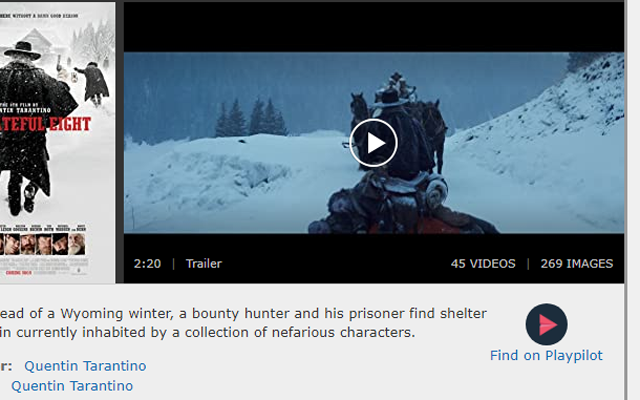

# Playpilot IMDb Extension
 Adds a Playpilot link on IMDb.com movies and series. Clicking the link sends you to Playpilot search.

 

## Install from Github

1. Download the code from Github
2. Open the Extension Management page by navigating to chrome://extensions.
    - The Extension Management page can also be opened by clicking on the Chrome menu, hovering over More Tools then selecting Extensions.
3. Enable Developer Mode by clicking the toggle switch next to Developer mode.
4. Click the LOAD UNPACKED button and select the downloaded extension folder.

## Possible improvements
- Link directly to correct movie and do a search fallback
  - Playpilot does some title URL magic, such as remove "the" from The Hateful Eight
- Add content script for Rottentomatoes